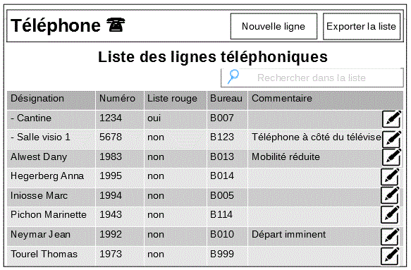
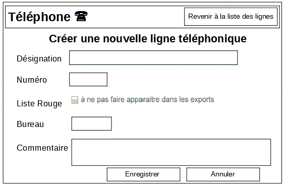
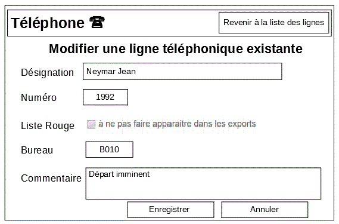
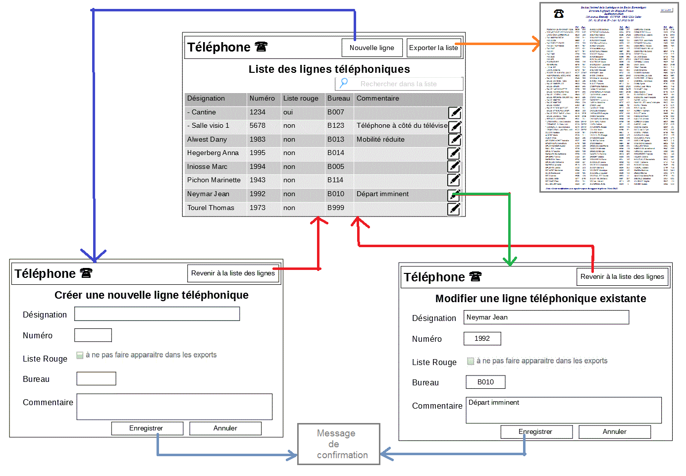

# Spécifications

## Description synthétique du besoin

Monsieur R. doit gérer l'ensemble des lignes téléphoniques d'un des établissements d'une administration.

Les lignes téléphoniques de l'établissement peuvent être mises à disposition :

- à des agents dans leur bureau
- dans des salles de réunion
- à certains endroits de l'établissement (cantine, local technique, ...)

Le "comité de normalisation des noms d'application à consonance musicale" s'est réuni sur le sujet et il a été décidé d'appeler cette application Téléphone.

L'objectif de l'application Téléphone sera donc de permettre la gestion d'une base de lignes téléphoniques.

## C'est quoi une ligne téléphonique ?

Une ligne téléphonique est caractérisée par les informations suivantes :

- **Désignation** : nom et prénom de l'agent, nom de la salle, ou "En attente" (Obligatoire)

      	Monsieur R. a l'habitude de saisir les désignations de la manière suivante :

        [Nom Prénom] pour les agents qui travaillent pour son administration (ex: Neymar Jean).
        [- Nom de Salle] pour les salles  (ex : - Salle Binbin).
        [* Nom Prénom] pour certains agents qui travaillent dans le même bâtiment mais dans une autre administration (ex : * Public Marius-Trésor).
        "En attente" lorsqu'une ligne devient disponible suite par exemple au départ à la retraite d'un agent.

- **Numéro** : numéro court du poste abrégé sur 4 chiffres (Obligatoire)

         Un même numéro ne pourra être affecté qu'à une seule désignation

- **Liste rouge** : une ligne sur liste rouge ne devra pas apparaitre dans le résultat de la fonction d'export

- **Bureau** : numéro du bureau ou de la salle où aboutit la ligne.

- **Commentaire** : commentaire libre sur 200 caractères

## Fonctionnalités attendues

Monsieur R. devra pouvoir :

- **Visualiser la liste de l'ensemble des lignes** de sa base avec la possibilité de filtrer sur certains critères (Désignation, Numéro)
- **Créer une nouvelle ligne téléphonique**
- **Modifier une ligne téléphonique existante**
- **Exporter un sous ensemble de lignes** sous la forme d'une liste pour la mettre à disposition des agents de l’établissement.

### Lister les lignes téléphoniques

L'application devra être en mesure de présenter l'ensemble des lignes de la base sous la forme d'un tableau.

Dans ce tableau figureront l'ensemble des informations de chacune des lignes de la base.

Les lignes de ce tableau seront triées par défaut sur la première colonne qui désignera le "propriétaire" de la ligne.

Une fonction de recherche permettra à Monsieur R. de filtrer les lignes de la base sur son contenu (Désignation, Numéro).

### Créer une nouvelle ligne

L'écran de création d'une nouvelle ligne devra permettre de saisir l'ensemble des informations relatives à la ligne téléphonique, à savoir sa désignation (obligatoire), son numéro (obligatoire), s'il doit figurer sur liste rouge, le numéro de bureau associé et un commentaire libre.

L'enregistrement de la nouvelle ligne dans la base devra être signifié à l'utilisateur par un message de confirmation (ou pop up).

### Modification d'une ligne existante

L'accès à l'écran de modification d'une ligne existante se fera en cliquant sur l’icône modifier (ou un texte équivalent) présenté à côté des informations de la ligne dans le tableau listant les lignes.

### Export d'une liste de ligne

La fonctionnalité d'export devra permettre de récupérer l'ensemble des lignes téléphonique _qui ne sont pas_ sur liste rouge en ne gardant uniquement que les couples Designation - Numéro.
Dans cet export, les lignes devront être ordonnées par Désignation.

## Maquettes

### Page d'accueil

### Écran de création d'une ligne téléphonique

### Écran de modification d'une ligne téléphonique

## Navigation

