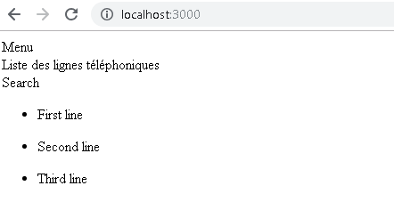
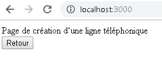
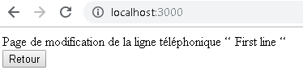
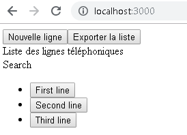

# Class components

## But

Créer des **Class Component**, avec state, props et prop-types.

## Enoncé

L'application contient une page de création et une page de modification des lignes téléphoniques.

Pour enrichir ainsi l'application :

- modifier le composant d'affichage de la liste des ligne téléphoniques (en créant le fichier [`fake-list.js`](https://github.com/InseeFrLab/BootcampJS-JS/tree/master/src/utils/fake-list.js) dans le dossier `utils`):



- créer 2 nouvelles pages minimalistes, par exemple :

  

  

- permettre la navigation entre les 3 pages de l'application (avec de simples `<button />` html ou presque)



## Proposition de code

```bash
git clone https://github.com/InseeFrLab/BootcampJS-JS.git
cd BootcampJS-JS
git checkout 4193a3ebda4b16a56e5e8bd8ae08dadc9696e072
```
