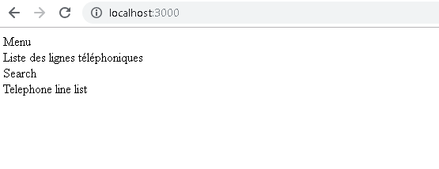

# Functional components

## But

Vous allez définir et assembler vos premiers composants.

## Enoncé

L'écran d'accueil de l'application est composé :

- d'un menu
- d'un titre
- d'un champ de recherche
- de la liste des lignes téléphoniques

Vous allez donc pouvoir reprendre votre coquille create-react-app et :

- supprimer tous les fichiers contenus dans `src` exception faite pour le fichier `index.js`
- créer un composant `root.js` qui sera le composant de plus haut niveau de votre application
- créer vos premiers composants pour aboutir à une page d'accueil minimaliste :



_Pensez à mettre en place une arborescence fine pour éviter d'empiler de nombreux fichiers dans vos dossiers_

## Proposition de code

```bash
git clone https://github.com/InseeFrLab/BootcampJS-JS.git
cd BootcampJS-JS
git checkout 8f5c5c0fa43a67a8e66c0e0319aef58a5481fee3
```
